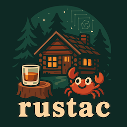
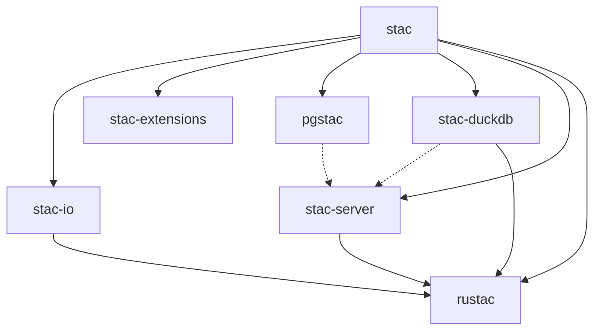

# rustac

[](https://github.com/stac-utils/rustac/actions/workflows/ci.yml)

[](./CODE_OF_CONDUCT)



The power of Rust for the STAC ecosystem

**rustac** is a monorepo of Rust crates for the [SpatioTemporal Asset Catalog (STAC)](https://stacspec.org/) specification.
We have a Python package derived from **rustac** in its own repository, [rustac-py](https://github.com/stac-utils/rustac-py).
For more on the difference between **rustac** and **rustac-py**, see [our docs](https://stac-utils.github.io/rustac/).

## Command line interface

Our command line interface (CLI) can query STAC APIs, validate STAC, and more.
Install:

```shell
python -m pip install rustac
# or
cargo install rustac
```

Then:

```shell
# Search
$ rustac search https://landsatlook.usgs.gov/stac-server \
    --collections landsat-c2l2-sr \
    --intersects '{"type": "Point", "coordinates": [-105.119, 40.173]}' \
    --sortby='-properties.datetime' \
    --max-items 1000 \
    items.parquet

# Translate formats
$ rustac translate items.parquet items.ndjson
$ rustac translate items.ndjson items.json

# Migrate STAC versions
$ rustac translate item-v1.0.json item-v1.1.json --migrate

# Search stac-geoparquet (no API server required)
$ rustac search items.parquet

# Server
$ rustac serve items.parquet  # Opens a STAC API server on http://localhost:7822

# Validate
$ rustac validate item.json
```

## Crates

This monorepo contains several crates:

| Crate                                            | Description                                                             | Badges                                                                                                                                                                                                                                                                  |
| ------------------------------------------------ | ----------------------------------------------------------------------- | ----------------------------------------------------------------------------------------------------------------------------------------------------------------------------------------------------------------------------------------------------------------------- |
| [stac](./crates/core/README.md)                  | Core data structures                                                    | [](https://docs.rs/stac/latest/stac/) <br> [](https://crates.io/crates/stac)                                                        |
| [stac-io](./crates/io/README.md)                 | Input and output                                                        | [](https://docs.rs/stac-io/latest/stac_io/) <br> [](https://crates.io/crates/stac-io)                                         |
| [stac-extensions](./crates/extensions/README.md) | Basic support for [STAC extensions](https://stac-extensions.github.io/) | [](https://docs.rs/stac-extensions/latest/stac_extensions/) <br> [](https://crates.io/crates/stac-extensions) |
| [stac-server](./crates/server/README.md)         | STAC API server with multiple backends                                  | [](https://docs.rs/stac-server/latest/stac_server/) <br> [](https://crates.io/crates/stac-server)                     |
| [pgstac](./crates/pgstac/README.md)              | Bindings for [pgstac](https://github.com/stac-utils/pgstac)             | [](https://docs.rs/pgstac/latest/pgstac/) <br> [](https://crates.io/crates/pgstac)                                              |
| [stac-duckdb](./crates/duckdb/README.md)         | Search **stac-geoparquet** with [duckdb](https://duckdb.org/)           | [](https://docs.rs/stac-duckdb/latest/stac_duckdb/) <br> [](https://crates.io/crates/stac-duckdb)                     |
| [stac-validate](./crates/validate/README.md)     | JSON schema validation                                                  | [](https://docs.rs/stac-validate/latest/stac_validate/) <br> [](https://crates.io/crates/stac-validate)           |
| [stac-wasm](./crates/wasm/README.md)             | WebAssembly bindings for Arrow to STAC conversions                      | [](https://www.npmjs.com/package/stac-wasm)                                                                                                                                                             |
| [rustac](./crates/cli/README.md)                 | Command line interface                                                  | [](https://docs.rs/rustac/latest/rustac/) <br> [](https://crates.io/crates/rustac)                                              |

They're all related:



> [!NOTE]
> There's one additional crate in [crates](./crates/), [stac-derive](./crates/derive/).
> This is not published and is for internal use only.

## Development

See [CONTRIBUTING.md](./CONTRIBUTING.md) for information about contributing to this project.
See [RELEASING.md](./RELEASING.md) for a checklist to use when releasing a new version.

## Acknowledgements

We'd like to thank [@jkeifer](https://github.com/jkeifer), [@parksjr](https://github.com/parksjr), and [@Xenocide122](https://github.com/Xenocide122) (all from [@Element84](https://github.com/Element84)) for creating the [rustac logo](./img/rustac.svg) from an AI-generated image from this prompt:

> There is a library for working with STAC metadata that is written in rust called rustac: <https://github.com/stac-utils/rustac>. That name sounds like the word "rustic", and is meant to envoke (sic) an image of "a cabin and a glass of neat whisky".

## License

**rustac** is dual-licensed under both the MIT license and the Apache license (Version 2.0).
See [LICENSE-APACHE](./LICENSE-APACHE) and [LICENSE-MIT](./LICENSE-MIT) for details.

<!-- markdownlint-disable-file MD033 -->
